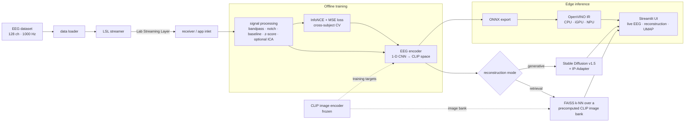

# Visual Cortex Reconstructor

[](LICENSE)
[](https://www.python.org/)

Reconstruct the image a person was looking at from their EEG signal — fully offline, on a consumer laptop with no discrete GPU.

A 0.5-second, 128-channel EEG trial (1000 Hz) is streamed over [Lab Streaming Layer](https://github.com/sccn/labstreaminglayer), encoded into the CLIP image-embedding space by a 1-D CNN, and then turned back into a picture in one of two ways: **retrieval**, which looks up the nearest image in a precomputed CLIP bank, or **generative**, which conditions Stable Diffusion v1.5 + IP-Adapter on the predicted embedding. A Streamlit split-screen demo shows the live brainwaves on one side and the reconstruction on the other.

> **About this project.** This is a personal research and portfolio project — an engineering exercise in running a modern multi-model pipeline end-to-end, fully offline, on modest hardware. It is not a medical device and not a scientific result. Several of the quality gates below are validated on *synthetic* EEG because the real dataset ([Spampinato et al.](https://github.com/perceivelab/eeg_visual_classification)) is gated behind a manual download I haven't completed; the tables say plainly what is real and what is synthetic. I'd rather under-claim than overclaim.

## How it works



The CLIP image encoder is **frozen** — it supplies the training targets for the EEG encoder
*and* builds the retrieval bank; it is never fine-tuned. The encoder is trained with a
combined InfoNCE (0.7) + MSE (0.3) objective under cross-subject cross-validation
(leave-one-subject-out is the reported gate; a shuffled scheme is available for capacity
checks). At inference the PyTorch encoder can be swapped for an OpenVINO IR by flipping a
single value in `config.yaml`.

## Hardware target

- Intel Core Ultra 5 225H (CPU + integrated NPU + integrated graphics)
- 32 GB DDR5, no discrete GPU
- Linux (Arch-based)
- ~100 GB free disk

Inference runs fully offline. CLIP and Stable Diffusion are downloaded once during setup, then frozen.

## Setup

The project expects a Python 3.14 virtual environment at `./.venv/`. If you don't have one:

```bash
python3.14 -m venv .venv
```

Then run the idempotent bootstrap:

```bash
./setup.sh
```

This installs the pinned dependencies (CPU-only torch, transformers 4.x, diffusers 0.38,
OpenVINO 2026.1, …), attempts to download the EEG dataset (Spampinato primary, THINGS-EEG2
fallback) and the 40-class ImageNet stimulus subset, then runs a smoke-import check.

Both dataset downloads exit gracefully when the source requires manual acknowledgment
(Google Drive / OSF). When that happens, follow the printed instructions to fetch the bundle
manually and re-run `setup.sh`.

On Arch Linux, `pylsl` benefits from a system `liblsl`:

```bash
sudo pacman -S liblsl
```

If it's absent, `pylsl` falls back to its wheel-bundled library — that works, but the system package is preferred.

## Run

```bash
# Virtual EEG rig (LSL streamer + receiver)
.venv/bin/python -m streaming.lsl_streamer --speed 1.0
.venv/bin/python -m streaming.lsl_receiver

# Offline preprocessing (requires the Spampinato bundle)
.venv/bin/python -m preprocessing.run_pipeline

# Train the EEG → CLIP encoder (requires preprocessed data)
.venv/bin/python -m models.train

# Retrieval spot-check on held-out trials
.venv/bin/python -m scripts.spot_check_retrieval --ckpt runs/<run-id>/fold_<sid>/best.ckpt

# OpenVINO vs. torch benchmark
.venv/bin/python -m scripts.bench_ov_vs_torch

# Demo app (two terminals). The app auto-discovers the latest checkpoint under
# runs/*/fold_*/best.ckpt, and falls back to a random encoder if none exists.
.venv/bin/python -m streaming.lsl_streamer --speed 1.0 &
.venv/bin/streamlit run app/streamlit_app.py
```

Retrieval is the default mode and the fast path; the generative path is heavier and is
selected via `generation.mode` in `config.yaml`.

## Current results

The gates are split into what has been **validated end-to-end** and what is **still gated**
on artifacts not shipped in the repo. Synthetic runs exercise every code path (encoder, loss,
cross-validation loop, evaluation, checkpointing) but do **not** stand in for a real accuracy
number.

| Gate | Target | Current | Source |
|---|---|---|---|
| `pytest -m "not integration"` | all pass | **114 / 114 pass** | local suite |
| Overfit-100 sanity | train top-1 ≥ 0.95 | **1.000** | [results/sanity/summary.json](results/sanity/summary.json) |
| Synthetic LOSO end-to-end | clean run, no crashes | **3 folds × 5 epochs completed** | [results/loso_synthetic/summary.json](results/loso_synthetic/summary.json) |
| OpenVINO bit-exactness vs. torch | atol 1e-3 over 100 trials | **passes** (max diff 2.98e-8) | [tests/test_openvino_export.py](tests/test_openvino_export.py) |
| OpenVINO speedup (median/median) | 2–5× | **1.89× CPU-only** (NPU driver absent on dev box) | [results/phase5_bench.json](results/phase5_bench.json) |
| End-to-end latency (retrieval) | p95 < 2 s | **p95 = 167.7 ms · median 51.9 ms** | [results/phase6_e2e/summary.json](results/phase6_e2e/summary.json) |
| Real-data LOSO top-5 ≥ 30 % | spec gate | ⏸ awaiting Spampinato dataset | — |
| End-to-end latency (generative) | p95 < 60 s | ⏸ awaiting Stable Diffusion weights | — |

## Roadmap

The engineering for every stage is in place; what remains needs data or weights not in the repo:

1. **Fetch the Spampinato dataset** (manual Google Drive download). The downloaders print
   step-by-step instructions; re-run `setup.sh` after placing the `.pth` file under
   `data/raw/spampinato/`.
2. **Full leave-one-subject-out training** on real data, to fill in the top-5 accuracy gate:
   `.venv/bin/python -m models.train`.
3. **Generative path** end-to-end, once the Stable Diffusion weights are cached:
   `pytest -m integration tests/test_sd_generator.py`.
4. **Spot-check and comparison grids** on real held-out trials via
   `scripts/spot_check_retrieval.py` and `scripts/compare_generators.py`.
5. **Record a short demo** of the Streamlit app for this README.

## Configuration

Every runtime parameter — paths, model IDs, hyperparameters, UI strings, colors, filter
cutoffs — lives in [config.yaml](config.yaml). Code never references literal values: the
[`utils.config`](utils/config.py) loader returns a frozen, pydantic-validated `Config`
object, and `tests/test_no_magic_strings.py` enforces this. To run with an alternate config,
set `VCR_CONFIG=/path/to/alt.yaml` or pass `path=` to `load_config()`.

## Tech stack

- **EEG / signal processing:** MNE, SciPy, `pylsl` (Lab Streaming Layer)
- **Representation learning:** PyTorch (CPU), CLIP ViT-B/32 (512-dim) via `transformers`
- **Retrieval:** FAISS (`IndexFlatIP` over unit-norm embeddings)
- **Generation:** diffusers — Stable Diffusion v1.5 + IP-Adapter
- **Edge inference:** ONNX + OpenVINO (CPU / iGPU / NPU)
- **App:** Streamlit, Plotly, UMAP
- **Foundations:** pydantic config, pytest, TensorBoard

## Repository layout

```
.
├── config.yaml          # single source of truth for every parameter
├── requirements.txt     # pinned deps (CPU torch via the PyTorch CPU index)
├── setup.sh             # idempotent bootstrap (uses an existing .venv/)
├── utils/               # config loader (pydantic), seeding, logging
├── data/                # dataset + ImageNet stimulus downloaders
├── preprocessing/       # data loader, filters, ICA, CLIP-bank precompute
├── streaming/           # virtual LSL EEG rig + receiver
├── models/              # encoder, losses, dataset, training, ONNX/OpenVINO export
├── generation/          # retrieval (FAISS) + Stable Diffusion + IP-Adapter
├── evaluation/          # top-K, cosine, centroid purity, UMAP/t-SNE/confusion matrix
├── app/                 # Streamlit demo + components + theme
├── scripts/             # sanity / bench / spot-check / e2e drivers
├── tests/               # pytest suite + integration tests
└── results/             # tracked JSON evidence (checkpoints gitignored)
```

## Data & acknowledgements

- **EEG dataset:** [Spampinato et al., *Deep Learning Human Mind for Automated Visual Classification*](https://github.com/perceivelab/eeg_visual_classification) (primary), with [THINGS-EEG2](https://osf.io/anp5v/) as a fallback. Datasets are **not** redistributed here — download them from the original sources under their own licenses, and please cite the authors if you use their data.
- **CLIP:** `openai/clip-vit-base-patch32` via Hugging Face `transformers`.
- **Generation:** `runwayml/stable-diffusion-v1-5` with [IP-Adapter](https://github.com/tencent-ailab/IP-Adapter) (`h94/IP-Adapter`), via `diffusers`.
- **Streaming:** [Lab Streaming Layer](https://github.com/sccn/labstreaminglayer).

## License

Released under the [MIT License](LICENSE).
